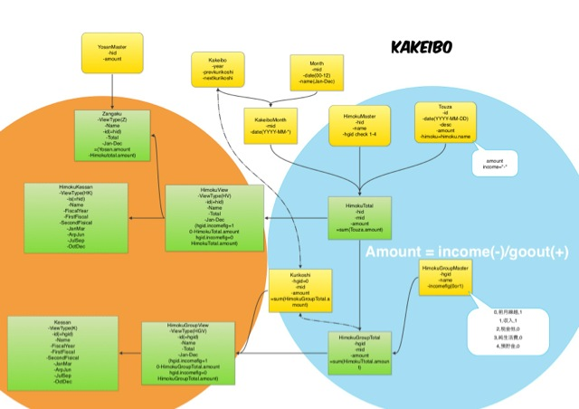

kakeibo
====
これは何？
----
家計簿集計のsqlite3 DBを作成/繰越金計算

* 一年分の家計簿データの集計を行う
+ 費目別/月別集計(HimokuView)
+ 費目別予算に対する残高集計(Zangaku)
+ 費目集計決算集計(HimokuKessan)
+ 繰越集計(HimokuGroupView)
+ 決算集計(Kessan)
* データは全インポートのみ。差分インポートはなし。複数のデータ元のインポートは結合インポートとして扱われる

### なんちゃってER図

[元画像を見る](https://www.dropbox.com/s/4dscrjm7bytdazk/Document_2013-02-15_15-10-09.jpeg)

設定
----
### 費目設定ファイル himoku.csv

conf\[/user\]/himoku.csv

columns= id,Name,HimokuGroupid

col | desc |
--- |--- | 
id |  一意のキー.数字. | 
Name | 費目名.残額メモではタグと呼ばれるもの. | 
HimokuGroupid | 費目の対応する費目グループid.1-4までのいずれかの数字. | 

#### 費目グループ

費目グループid | 名前 | 
--- |--- | 
1 | 収入 | 
2 | 税金他 | 
3 | 純生活費 | 
4 | 預貯金 | 

収入-税金他が可処分所得.

### 予算設定ファイル yosan.csv

conf\[/user\]/yosan\[YYYY\].csv

columns = Himokuid,Yosan

Col | Desc |
--- |--- | 
Himokuid | 費目id | 
Yosan | 費目の一ヶ月の予算 | 

* 予算は費目に対する通年予算を12で割った金額を一ヶ月予算とする.

コマンド 家計簿DB(sqlite3)の構築/データインポート
----
### 家計簿DBの構築 build.sh

出力ファイル

data\[/user\]/YYYYkakeibo.sqlite3

    "Usage: ./build.sh -y YYYY \[-k 前年度繰越金\] \[-u user\[-h\] \[-b\]\]"

option | arguments | desc |
---  | ---  | ---  | 
-y | YYYY | 家計簿年 | 
-k | 数字 | 前年度繰越金.defaul.任意の英数t 0 | 
-u | user | ユーザ名.任意の英数文字 | 
-h | フラグ | -u、-hがある場合、conf/user/配下の費目設定ファイルを読み込む default conf/himoku.csv | 
-b | フラグ | -u、-bがある場合、conf/user/配下の予算設定ファイルを読み込む default conf/yosan.csv | 

### データインポート import.sh

+ データのインポートと繰越金計算を行っている.
+ データは当年1/1から翌年1/31までをインポートする.
+ -yオプション省略時は当年家計簿で処理を行う.

#### インポート元データ準備

残額メモのエクスポートデータのうち、zanmemo.dat2をdata\[/user\]ディレクトリに入れる.

#### インポート

import.shを実行する.

    "Usage: ./import.sh [-y YYYY\] \[-u user\] \[-i importtype\] \[-j\]

option | arguments | desc |
---  | ---  | ---  | 
-y | YYYY | 家計簿年 | 
-u | user | ユーザ名.任意の英数文字 | 
-i | importtype | default.zanmemo | 
-j | フラグ | 複数のインポートデータがある場合は先に登録されたデータに対して結合して登録する | 

##### *当座テーブル(Touza)*

インポートされたデータは、当座テーブルに格納される。

    sqlite3> SELECT * FROM Touza;
    id,Date,Desc,Amount,Himoku

Col | Desc | 
---  | ---  | 
id | プライマリキー | 
Date | YYYY-MM-DD形式 sqlite3の日付形式で検索可能 | 
Desc | 摘要.残額メモのタイトル | 
Amount | 金額.収入はマイナス、支出は自然数 | 
Himoku | 費目名.残額メモのタグ | 

### ログイン login.sh

login.shを実行する.-yオプション省略時は当年家計簿にログインする.

    > ./login.sh \[-y YYYY\] \[-u user\]

### コマンド使用例

    > ./build.sh -y 2013 -u shino -h -b
    > ./import.sh -y 2013 -u shino
    > ./login.sh -y 2013 -u shino

独自のmyデータとzanmemoデータがある
(あらかじめ独自データインポートのsql/import.my.sqlを作成する)

    > ./build.sh -y 2012 -u shino -h
    > ./import.sh -y 2012 -u shino -i my
    > ./import.sh -y 2012 -u shino -j
    > ./login.sh -y 2012 -u shino

sqlite3 集計参照
----
### 費目集計(HimokuView)

    sqlite3> SELECT * FROM HimokuView;
    ViewType,id,Name,Jan,Feb,Mar,Apr,May,Jun,Jul,Aug,Sep,Oct,Nov,Dec

Col | Desc | 
---  | ---  | 
ViewType | HV | 
id | 費目id | 
Name | 費目名 | 
Total | 費目別年間合計 | 
Jan-Dec | 1月から12月の費目ごとの集計金額 | 

### 費目別予算残額集計(予算を立てた人)(Zangaku)

    sqlite3> SELECT * FROM Zangaku;
    ViewType,id,Name,Jan,Feb,Mar,Apr,May,Jun,Jul,Aug,Sep,Oct,Nov,Dec
    
Col | Desc | 
---  | ---  | 
ViewType | Z | 
id | 費目id | 
Name | 費目名 | 
Total | 費目別年間予算残額合計 | 
Jan-Dec | 1月から12月の費目ごとの予算対する残額金額.残額が予算超過（赤字)はマイナス.  繰越タイプが収入(1)の費目は予算に対する不足金額がマイナス.   | 

*応用 特定月の費目と予算に対する赤字/黒字を知りたい*(1月の場合)

    sqlite3> SELECT h.name AS himoku,h.Jan AS Jan,z.Jan AS zangaku
    sqlite3> FROM HimokuView AS h,Zangaku AS z
    sqlite3> WHERE h.id=z.id;
    himoku,Jan,zangaku

### 繰越金集計(HimokuGroupView)

    sqlite3> SELECT * FROM HimokuGroupView;
    ViewType,id,Name,Jan,Feb,Mar,Apr,May,Jun,Jul,Aug,Sep,Oct,Nov,Dec

Col | Desc | 
---  | ---  | 
ViewType | HGV | 
id | 費目グループid | 
Name | 費目グループ名 | 
Total | 費目グループ別年間合計 | 
Jan-Dec | 1月から12月の費目グループ別集計金額.前月繰越金は、前月の"前月繰越金+収入-(純生活費-税金他-預貯金)" | 

繰越金集計の *翌月の前月繰越金* が、実際の *当月の赤字/黒字* を示している.

*応用 費目集計と繰越金集計を一気に知りたい.*

    sqlite3> SELECT * FROM HimokuView 
    sqlite3> UNION
    sqlite3> SELECT * FROM HimokuGroupView 
    sqlite3> ORDER BY ViewType,id;

### 決算(HimokuKessan / Kessan)

費目別決算と収入、税金他など費目グループの決算が取得できる.

費目別決算

    sqlite3> SELECT * FROM HimokuKessan;

決算

    sqlite3> SELECT * FROM Kessan;

項目は共通

    Name,Total,FiscalYear,FirstFiscal,SecondFiscal,JanMar,AprJun,JulSep,OctDec 

Col | Desc | 
---  | ---  | 
Name | 費目名または費目グループ名（収入、税金他、純生活費、預貯金) | 
FiscalYear | 12ヶ月決算(1-12月) | 
FirstFiscal | 上半期決算(1-6月) | 
SecondFiscal | 下半期決算(7-12月) | 
JanMar | 四半期決算(1-3月) | 
AprJun | 四半期決算(4-6月) | 
JulSep | 四半期決算(7-9月) | 
OctDec | 四半期決算(10-12月) | 

### 次年度繰越金取得

次年度繰越金を取得する.

    sqlite3> SELECT NextKurikoshi FROM Kakeibo;

Col  |  Desc  | 
---  | ---  | 
NextKurikoshi  |  次年度繰越金  | 

ライセンス
----

CC BY-NC-SA

